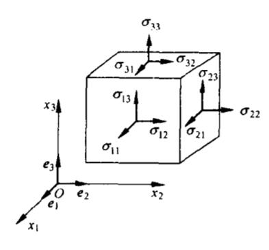
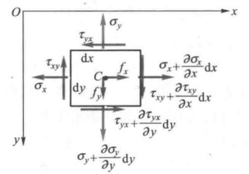
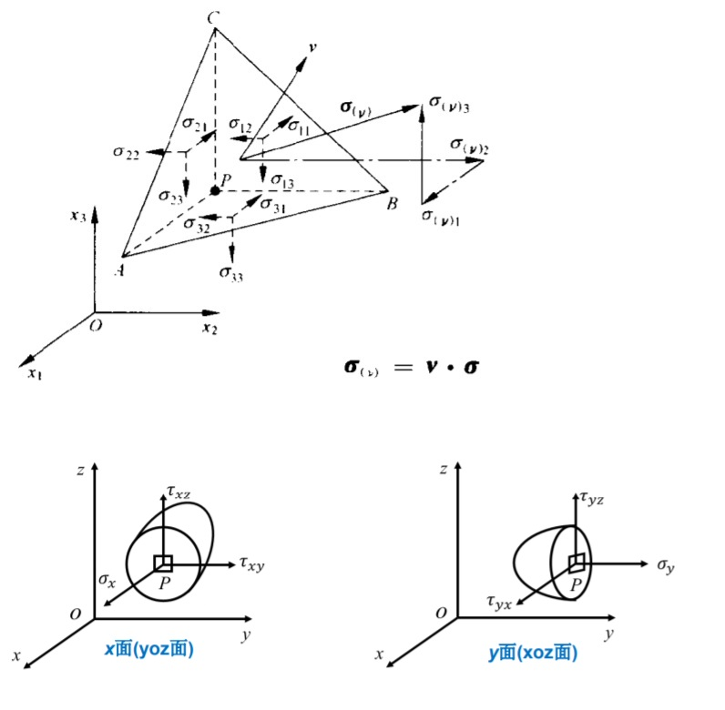
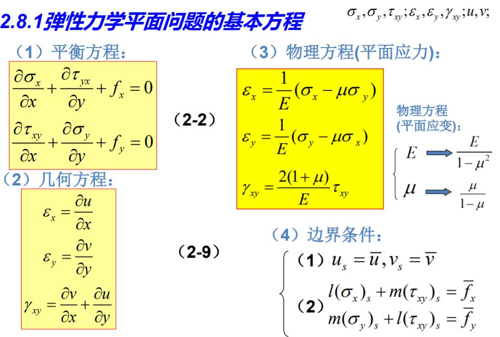
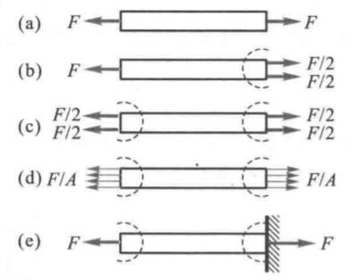
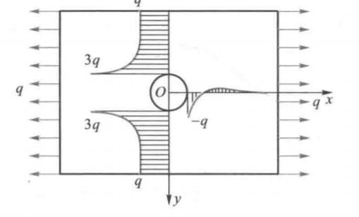

弹性力学与人生

## 人的状态是很多分量的集合。

弹性力学“一点的应力状态”：九个标量组成的张量（矩阵）才能完全表达一点在一时的应力状态。要描述人的外在、内在、环境，必然是无比繁多的分量的集合。

一点在不同时间的应力状态也是不同的，人的状态的每个分量都是时间的函数。

## 不同人的状态是不一样的，即使他们是相邻的。

弹性力学“不同点的应力状态”：即使均质、各向同性的理想假设下，即使相邻的两个微元、甚至一个微元的左右两个面，也具有不同的应力状态。

## 人处在环境中，就会受到作用力。

弹性力学“外力”：外力包括体力和面力，体力比如重力是常态化受到的全域外力，而面力比如别人推了一把，是局部外表面受到的外力。

## 即使在同一时刻，不同角度去看，人的状态也是不同的。不同的人评价同一个人结论不同是正常的。

弹性力学“斜面上的应力（Cauchy stress equation）”：过一点，不同的斜面上具有不同的应力矢量、直角系下的应力分量也不同。

## 人的状态在一些条件下可以达到极限。比如为某件事全力以赴、全神贯注的状态。

弹性力学“最大主应力”：在某一截面上，可以没有切应力，而正应力达到最大值。

## 人具有始终不变的一些內秉特征，这可以影响很多方面。

弹性力学“应力不变量”：最大主应力的和与应力主分量（正应力）的和相等。这是一个应力不变量I1.

## 在错开的角度下，存在着人生的另一种极限。

弹性力学“最大切应力”，在与正应力方向成45°的平平面上，存在着最大的切向应力。

## 有的长长的人生，始终只是一个状态的延伸。

弹性力学“平面问题”：比如平面应变，大坝，每个截面始终是相同的，研究这个截面状态的延伸（拔模），和研究任何一个二维截面没有什么区别。

## 人与所处环境有一种潜在的约束平衡关系。

弹性力学“基本方程中的平衡方程”：建立了外力体力与内部应力的等式方程组关系。

## 人所受的刺激和人作出的响应具有潜在关系。

弹性力学“基本方程中的物理（本构）方程”：建立了应力和应变的等式方程组关系。弹性力学“基本方程中的几何方程”：建立了位移和应变的关系。

根据人的内禀属性，他在同一类似刺激下作出的响应是可以预测的。这令人想到人的膝跳反射、受训练的马戏团动物的反射弧。

人的行为，行动、静止、快进、慢退，是每个细胞、每一部分应变（变形）积累（积分）得到的结果。

有了以上方程，按理说可以解析求解人的状态（但还有不可解、无解、过约束情况），大部分情况下，这还涉及到运用下面所说的圣维南原理。

## 只要处在环境中，你的行为就会受到外部环境的约束。人的自由度=全自由度-所受的约束条件。

弹性力学“边界条件”：包括力边界（外力中的面力）、这包括位移约束。

这相当于人会受到外部环境的载荷、人的运动往往因各种原因也限制在一定轨迹、方向、一定区域内。比如对于忙于学业的学生、忙于工作的上班族。

约束和自由度：正常三维条件下，物体中的一个无限小微元体具有9个自由度，每被约束一个（比如边界简支、固定等），自由度就相应减少，都被约束时就成了钉死状态（不可变化了的固定状态）。

## 远处的外部因素对人的影响很小。解决问题或者做出判断，要果断抛弃次要因素。

弹性力学“圣维南原理”：如果物体一小部分边界上的面力自成一个平衡力系（主矢量和主矩都等于零），那么这个面力就只会使近处产生显著的应力，而远处的应力可以不计。

圣维南原理的另一个推论是，无论多么大的外力，它的显著影响范围总有边界。只要超过了这个范围的区域，这个大的外力几乎不在此处产生应力。

圣维南原理是很多弹性力学问题求解的关键，首先它说明了远处的世界对近处的人几乎没什么影响，这可以解释日益加剧的地理隔离现象。

此外，运用圣维南原理简化问题、而求解还能足够精确，告诉我嫩，解决问题或者做出判断，要果断抛弃次要因素。

## 即使再大的物体，内部再小的孔洞也很容易会成为萌生损伤之处。

弹性力学“含孔平板的解”：无论孔的半径，受力时的应力分布峰值总是3倍于施加的外力（应力集中系数=3），应力峰值总是在孔洞边缘。半径只影响下降的趋势线。

## 有时，即使很小的外力反复作用，人也会难以承受。

疲劳：水滴石穿、手折钢丝都是基于疲劳的原理。即使外力再小，远小于强度，往复的作用也很容易产生损伤。